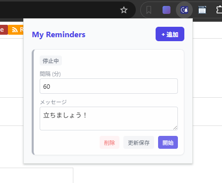

# **Flexible Reminder 🔔**

指定した間隔で定期的に通知を送る、シンプルで使いやすいChrome拡張機能です。  
長時間の作業中の休憩リマインダーや、定期的なルーチンワークの呼びかけに最適です。

## **✨ 特徴**

* **複数のリマインダー管理**: 目的別に複数の通知設定を作成・保存し、リスト形式で管理できます。  
* **柔軟な間隔設定**: 分単位で通知間隔を自由に設定可能です。  
* **カスタムメッセージ**: 通知ごとに好きなメッセージを設定し、デスクトップ通知で表示します。  
* **次回予定の可視化**: 次にいつ通知が来るかがひと目で分かります。  
* **個別ON/OFF**: リマインダーごとに有効/無効をワンクリックで切り替えられます。

## **🚀 使い方**

1. ブラウザのツールバーにある拡張機能アイコンをクリックして設定画面を開きます。  
2. タイトル横の **「+ 追加」** ボタンをクリックして、新しいリマインダーカードを作成します。  
3. **間隔（分）** と **通知メッセージ** を入力します。  
   * 例: 間隔 60、メッセージ 1時間経ちました。ストレッチしましょう！  
4. カード右下の **「開始」** ボタンを押すとリマインダーが有効になり、カウントが始まります。  
   * 停止したい場合は **「停止」** ボタンを押してください。  
   * 設定内容を変更した場合は **「更新保存」** ボタンで保存できます。  
   * 不要になったリマインダーは **「削除」** ボタンでリストから消去できます。
